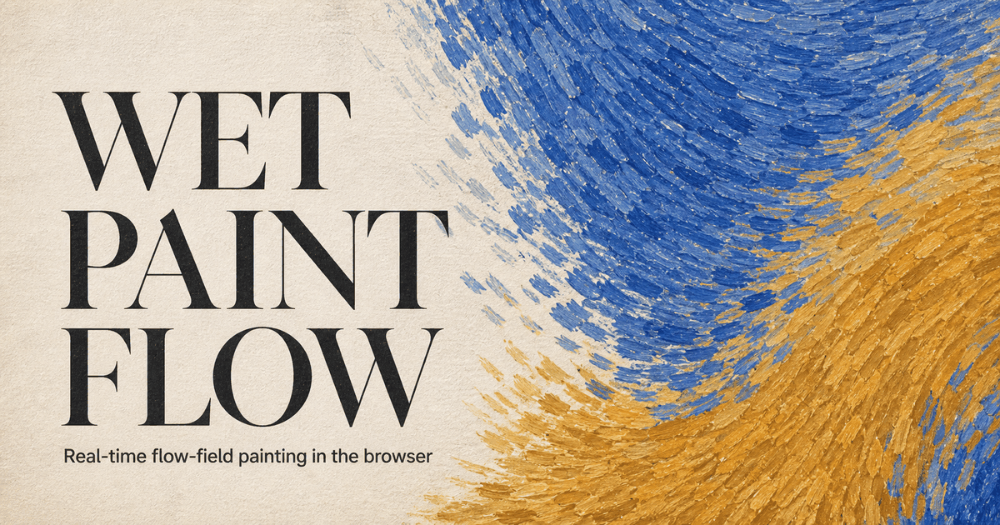

# Wet Paint Flow

[Live demo](https://wet-paint-flow.simonxxoo.chatgpt.site/) ·
[Asset provenance](./ASSET_PROVENANCE.md) ·
[Third-party notices](./THIRD_PARTY_NOTICES.md) ·
[Review](./docs/REVIEW.md)



Wet Paint Flow 是一个浏览器内运行的 Three.js 实时流场绘画实验。它从图片或
3D 场景提取结构方向，用稳定的粗、中、细三层 Bézier ribbon 笔触重建画面，
再以高度、湿度、刷毛沟槽和微表面光照合成湿油彩质感。

Wet Paint Flow is a browser-based Three.js flow-field painter. It derives a
structural direction field from an image or 3D scene, reconstructs the view
with stable coarse, medium, and fine Bézier ribbon strokes, and composites a
wet-paint surface from height, moisture, bristle, and lighting data.

> **Open-source status / 开源状态**
>
> The current built-in painting files now have recorded museum or Wikimedia
> Commons sources and reuse bases. This public repository starts from a clean
> root commit containing only the verified current tree; earlier private
> development history and removed, unverified image files are excluded. See
> [asset provenance](./ASSET_PROVENANCE.md).
>
> 当前 11 幅内置画作已记录美术馆或 Wikimedia Commons 来源与复用依据。公开
> 仓库从仅包含当前已核验文件的干净根提交开始；早期私有开发历史及其中已删除、
> 未核验的图片不会进入公开仓库。详见[资产溯源](./ASSET_PROVENANCE.md)。

## 核心能力 / Highlights

- **图片与 GLB / Images and GLB** — 导入 JPG、PNG、WebP、GIF 或单文件 GLB；
  也可使用内置球体、立方体、圆环和扭结。Import local images or a
  self-contained GLB, or start from built-in procedural geometry.
- **结构流场 / Structural flow field** — 结构张量、深度、法线与语义信息形成
  无箭头 line field，正反向积分为三次 Bézier 笔触。Structure, depth,
  normals, and semantic cues form an unoriented line field that drives
  bidirectional cubic Bézier strokes.
- **稳定三层笔触 / Stable three-layer strokes** — Poisson 分档播种保持笔触
  身份稳定，可独立显示粗、中、细层并重播生长。Stable Poisson-stratified
  seeds support replayable coarse, medium, and fine layers.
- **湿油彩合成 / Wet-paint shading** — 颜料高度、湿度和刷毛沟槽进入独立
  状态缓冲，再以高度法线和微表面高光合成。Paint height, wetness, and
  bristle channels feed a separate state buffer and a micro-surface composite.
- **结果与导出 / Output** — 支持纯笔触、原图、融合与流场手稿视图，可导出
  最长边 4096 px 的 PNG，并在浏览器支持时录制生长视频。Switch among
  stroke, source, blend, and flow-sketch views; export a 4096 px-edge PNG or a
  real-time growth recording when the browser supports it.
- **中英界面 / Bilingual UI** — 语言偏好只保存在当前浏览器设备。
  The language preference is stored only on the current device.

## 运行方式 / Quick start

推荐 Node.js 22；最低版本遵循 `package.json` 中的 engines 约束。
Node.js 22 is recommended; the exact supported range is declared in
`package.json`.

```powershell
npm ci
npm run dev -- --port 4186
```

打开 / Open:

```text
http://127.0.0.1:4186/
```

## 交互与隐私 / Interaction and privacy

上传的图片通过浏览器 object URL 解码，GLB 通过本地 `ArrayBuffer` 解析；项目
没有上传接口、分析服务或遥测。内置场景会从本站读取，语言偏好使用
`localStorage`。Imported images and GLB files stay in the browser. The project
has no upload endpoint, analytics service, or telemetry; only built-in scenes
are fetched from the site, and the language preference uses `localStorage`.

图片保持原始宽高比。旋转模型时先显示轻量 3D 预览，松手后只做一次方向场分析
和笔触重建，避免拖动中重复 GPU 读回。Images preserve their aspect ratio.
Model orbiting uses a lightweight 3D preview and performs one direction-field
analysis and stroke rebuild on release instead of repeatedly reading the GPU
while dragging.

## 架构与性能策略 / Architecture and performance

项目保持小而扁平的前端结构，不为一次性逻辑建立框架层：
The repository keeps a small, flat frontend surface and avoids framework layers
for one-off behavior:

- `main.js` — scene capture, direction-field analysis, seed integration,
  stroke geometry, rendering, interaction, and export
- `index.html` / `styles.css` — interface structure and presentation
- `public/scenes/` — browser-ready WebP derivatives and runtime manifest
- `worker/sites-static.js` — Sites static delivery and SPA fallback
- `tests/wet-paint-flow.test.js` — static architecture and regression checks
- `scripts/build-scene-library.py` — optional maintainer tool for rebuilding
  verified scene derivatives

主要性能边界 / Main performance boundaries:

- one instanced ribbon geometry represents all visible strokes;
- analysis results are reused when only stroke geometry or material changes;
- hot direction and color sampling paths avoid temporary allocations;
- rendering is continuous during growth and becomes demand-driven when idle;
- quality modes change internal analysis/render scale without changing exports;

发布目标为默认 **14,000** 笔、最大 **24,000** 笔。性能优化不得静默降低
笔触数、渲染比例、MSAA、shader 细节、材质 pass 或导出分辨率。The release
target is **14,000 strokes by default** and **24,000 maximum**. Optimization
must not silently reduce stroke count, render scale, MSAA, shader detail,
material passes, or export resolution.

本 README 不保留未经本轮复测的精确 FPS 或毫秒数字；当前验收状态记录在
[`docs/REVIEW.md`](./docs/REVIEW.md)。Exact frame-rate and timing claims are
published only after a fresh browser run; current acceptance status lives in
the review document.

## 场景库维护 / Rebuilding the scene library

这个可选脚本需要 Python 3.10+ 和受约束的 Pillow 12.x：
The optional maintainer script requires Python 3.10+ and the constrained
Pillow 12.x range:

```powershell
python -m pip install -r requirements-dev.txt
python scripts/build-scene-library.py <verified-source-directory>
```

原始画作文件不在仓库内。只有来源 URL 与数字复制品再分发权均已核验的文件才可
用于生成可提交资产；本地文件名不能作为授权证据。Original source images are
not distributed here. Do not commit generated derivatives until the exact
source URL and digital-reproduction redistribution rights are verified.

## 验证 / Validation

```powershell
npm run check
```

`check` 会运行 Vitest 静态回归测试和普通 Vite 生产构建。它不等于浏览器验收。
视觉或性能改动还必须在默认 14,000 和最大 24,000 笔下检查加载、交互、生长、
静止帧、PNG/视频导出和控制台错误。`check` runs the static Vitest regression
suite and a normal Vite production build. Visual and performance changes still
require browser acceptance at 14,000 and 24,000 strokes.

## Sites 部署 / Sites deployment

`npm run check` 最后生成普通 `dist/`。Sites 需要另一种目录布局，因此部署前
必须最后运行 `build:sites`：
`npm run check` leaves a normal Vite `dist/`; Sites requires its own layout, so
`build:sites` must be the final build step before packaging.

```powershell
npm ci
npm run check
# commit and push the exact accepted source state
npm run build:sites
```

随后以已推送 commit SHA 保存 Sites version，只部署该已保存版本，并回读部署
状态与生产 URL。Forks must bind their own Sites project; the checked-in
project ID does not grant deployment access.

## 贡献 / Contributing

欢迎范围清楚的小型 issue 和 pull request。修改前请先说明可观察问题，避免顺手
重构无关代码；提交前运行 `npm run check`，视觉或性能改动附 14k/24k 浏览器
证据。不要提交来源或授权不清的图像。Focused issues and pull requests are
welcome. Keep changes scoped, run `npm run check`, attach 14k/24k browser
evidence for visual or performance changes, and do not add assets without
verified provenance and redistribution terms.

普通问题使用 [GitHub Issues](https://github.com/simonxxooxxoo/wet-paint-flow/issues)。
安全问题请不要公开粘贴密钥、私有素材或个人数据；先通过仓库所有者的私密联系
渠道报告。Use GitHub Issues for ordinary bugs. Report sensitive security
issues privately to the repository owner rather than posting credentials,
private media, or personal data in public.

## 许可证与来源 / License and attribution

- Project code: [MIT](./LICENSE)
- Dependencies and inspiration: [THIRD_PARTY_NOTICES.md](./THIRD_PARTY_NOTICES.md)
- Bundled image status: [ASSET_PROVENANCE.md](./ASSET_PROVENANCE.md)

The MIT code license does not grant rights to third-party image assets; each
bundled image follows the source-specific status recorded above.
